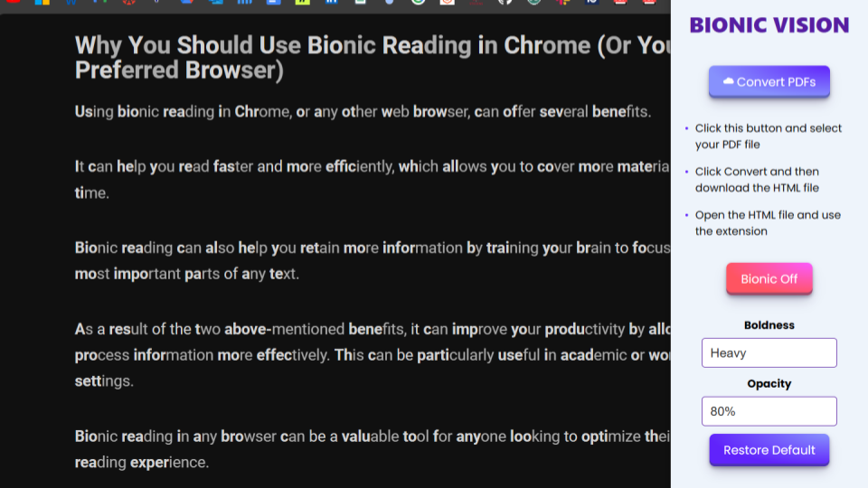

# Bionic-Vision
Our CS 545 Final Project
This Bionic Reading Extension Bionic Vision is a chrome browser extension designed to enhance reading experiences by utilizing bionic reading. Bionic reading involves techniques to optimize reading speed and comprehension by bolding the first half of each word the brain is able to complete the word automatically.

## Features
- **Focus Enhancement**: Minimize distractions and enhance focus on the current reading material.
- **PDF Functionality**: Apply bionic reading to PDFs through a free online PDF-to-HTML converter.
- **Customizable Options**: Choose from a variety of options to tailor to personal needs. 

## Installation
1. Download this repository as a zip file and extract its content.
2. Manage extensions in settings and turn on developer mode
3. Upload the extracted zip file by clicking on load unpacked
4. If you plan on changing any of the code must reload the uploaded folder to update

## Usage
1. **Activate Extension**: Click on the extension icon in the browser toolbar and click Toggle Bionic to turn on and off
2. **Adjust Settings**: Customize the reading experience by adjusting settings such as boldness and opacity
3. **Start Reading**: Navigate to your desired webpage or document and start reading with the enhanced bionic reading features.

## Acknowledgments
We would like to thank Bionify for their open-source code as this was developed from their Bionic Reading Algorithm. 
- [Bionify](https://github.com/Cveinnt/bionify)

## About
This extension was developed by [Lilli Nappi, Aditi Deshmukh, Ayushi Gupta, Shannon McGratty, and Matt Kearney](https://github.com/nappilil/Bionic-Vision).

