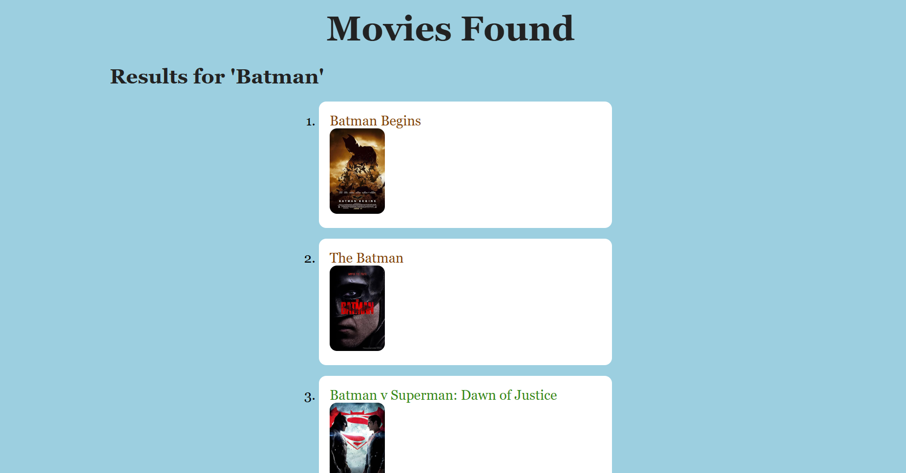

# Template Time

For this lab, will be using HTML, CSS, and Handlebars to make first simple templated web application! Will be building a form that allows you to search through movies in the [Open Movie Database API](https://www.omdbapi.com/).

## Example Image

## Open Movie Database API
Using two endpoints of the API for Axios calls. The search movie endpoint where you pass the search term as a query string parameter: [http://www.omdbapi.com/?apikey=[your_api_key]=[search_term_here]](Links to an external site.) and then you'll get an individual movie data using the endpoint

[http://www.omdbapi.com/?apikey=[your_api_key]=[movie ID here]](Links to an external site.) (in the data, the id field is named: imdbID)

Will use these two endpoints to make your `axios.get` calls depending on which route is called.

There are three routes/pages in the application:
- [http://localhost:3000/](http://localhost:3000/) the main page of this application will provide a search form to start a search of movies by title keyword.
- [http://localhost:3000/searchmovies](http://localhost:3000/searchmovies) this page will make the axios call to the search endpoint and return up to 20 matching results that contain the provided request form param, searchMoviesByName
- [http://localhost:3000/movie/{id}](http://localhost:3000/movie/{id}) this page will show all the details of the movie with the id matching the provided URL param, id. So for example: [http://localhost:3000/movie/tt0088847](http://localhost:3000/movie/tt0088847) makes an axios call to the API endpoint: [http://www.omdbapi.com/?apikey=[your_api_key]=tt0088847](http://www.omdbapi.com/?apikey=[your_API_key]=tt0088847)
All other URLS will return a 404
