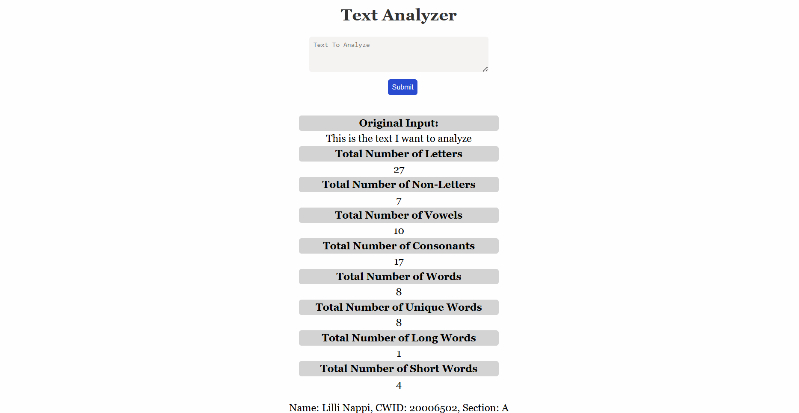

# CS-546 Lab 9

## Client-Side Text Analyzer

For this lab, used HTML, CSS, and JavaScript on the user's browser to make a simple client-side text analyzer!

Created an express server with a single page at the location `/` that provides the user with a web page to allow them to enter some text and calculate various statistics based on that text. The entire checking operation is done using client-side JavaScript.

## Example Image

### The Server
The server does not do any of the processing! It only exists to allow someone to get to the HTML Page and download the associated assets to run the Text Analyzer Page.

**/** The Whole Text Analyzer Application.

Using JavaScript in the browser only, it listens to the form's submit event; when the form is submitted, it will will:

- Get the value of the input text element.  
- Take in the text input, convert it to all lowercase, and generate some text statistics based on the input.
- Calculates the following statistics based on the text:

  - Original Input: show the input that the user entered 
  - Total Number of Letters: total number of letter characters in the text
  - Total Number of Non-Letters: total number of non-letters in the text (including spaces)
  - Total Number of Vowels: total number of vowels in the text (not counting y)
  - Total Number of Consonants: total number of consonants in the text (counting y)
  - Total Number of Words: total number of words in the text; a word is defined as any sequence of letters broken by any not-letter. For example, the phrase to-do is two words; a word does not start until a letter appears
  - Total Number of Unique Words: total number of unique words that appear in the lowercased text, if a word appears multiple times in the text, you count one occurrence of the word as a unique word
  - Total Number of Long Words: number of words in the text that are 6 or more letters long; this is a total count of individual words, not unique words
  - Total Number of Short Words: number of words in the text that are 3 or less letters long; this is a total count of individual words, not unique words
